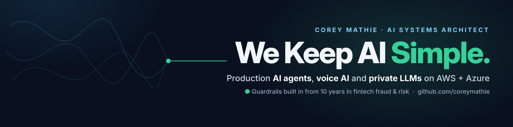
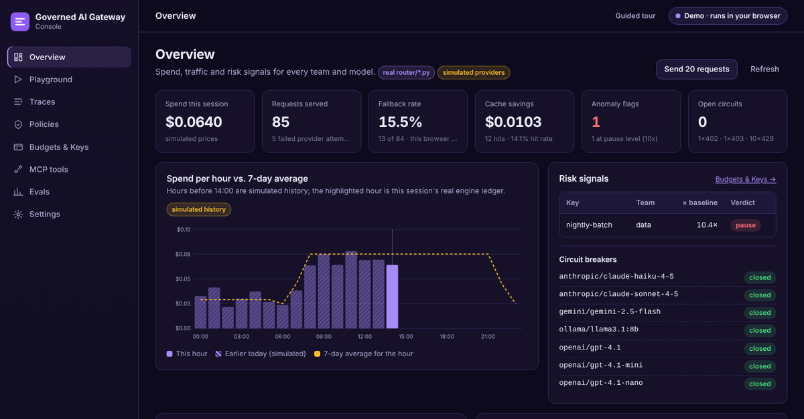
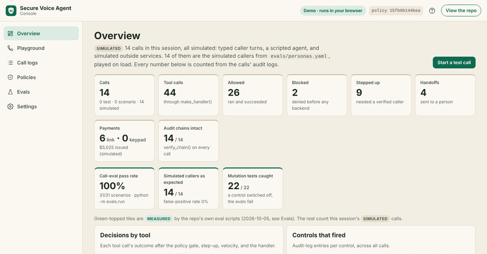
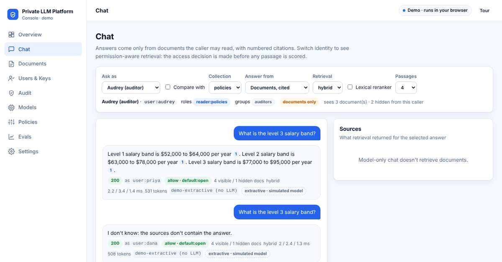

## Corey Mathie · AI Engineer & AI Solutions Architect

I design and build production AI systems for regulated, high-stakes workflows: **voice agents that take real actions**, **private LLM platforms for data that can't leave the building**, and **governed LLM gateways that control spend across providers**. The common thread is a deterministic control layer between the model and anything it can touch. Model output is treated as untrusted input; policy, identity, limits and audit are plain, tested code.

That approach comes from 10 years across fintech fraud, risk and customer operations, where velocity checks, idempotency, step-up verification and tamper-evident audit trails are how you run anything that moves money or touches customer data. AI agents now do both.

[LinkedIn](https://www.linkedin.com/in/coreymathie) · South Florida (US Eastern) · Open to remote, hybrid and relocation

---

### Try the consoles in your browser

Each project ships a full product console (dashboard, playground, traces, policy editor, evals) that runs the repo's **real Python modules** in the browser through Pyodide. No sign-up, no API keys, no backend. The same console runs against the real backend with `docker compose up`.

| [Governed AI Gateway](https://coreymathie.github.io/governed-ai-gateway/demo/) | [Secure Voice Agent](https://coreymathie.github.io/secure-voice-agent/demo/) | [Private LLM Platform](https://coreymathie.github.io/private-llm-platform/demo/) |
|:---:|:---:|:---:|
|  |  |  |
| Spend by team and model, take a provider down, open a request trace, edit policy and re-run | Run a test call or 14 simulated callers, open a call log's decision timeline, verify the audit chain | Ask as HR or engineering and get different cited answers, edit document permissions, verify the audit log |

---

### Reference architectures

| Repo | Scope | Engineering highlights |
|---|---|---|
| [**secure-voice-agent**](https://github.com/coreymathie/secure-voice-agent) | Phone AI agent that books, texts payment links, opens tickets and writes CRM notes. Twilio Media Streams + Pipecat + OpenAI Realtime (Claude cascade and Gemini Live alternates), AWS Lambda tool handlers, Fly.io/ECS voice workers | Default-deny policy gate with social-engineering risk scoring and per-call blast-radius caps · step-up OTP (caller ID is never identity) · PCI scope reduction with keypad `<Pay>` capture · AI disclosure and recording consent · HMAC-signed tool requests · velocity limits, idempotency, hash-chained audit · **31 call evals in CI**, 22 mutation tests, 14 simulated callers, 410 tests |
| [**private-llm-platform**](https://github.com/coreymathie/private-llm-platform) | Private, OpenAI-compatible LLM platform over Ollama or vLLM / SGLang / TGI / NVIDIA NIM. Laptop installers through Helm on Kubernetes and an air-gapped bundle | OIDC SSO with group-based roles · permission-aware (ACL) retrieval · hybrid BM25 + vector search with RRF and a RAG eval gate in CI · prompt-injection defense in depth · AES-GCM envelope encryption at rest · model digest pinning + CycloneDX ML-BOM · tamper-evident audit · 8 ADRs, 218 tests |
| [**governed-ai-gateway**](https://github.com/coreymathie/governed-ai-gateway) | Governed AI gateway: one OpenAI-compatible endpoint over OpenAI, Anthropic, Gemini and Ollama | Circuit breakers and latency-aware routing · org → team → key budgets and TPM limits · spend-anomaly auto-pause · showback/chargeback export · policy-as-code (YAML, optional OPA) · PII hooks with content logging off by default · route eval harness, CI cost/quality gate and shadow mode · semantic cache with a measured false-hit rate · MCP tool gateway · hashed API keys · per-request traces · 278 tests |

Every repo has architecture docs, documented failure modes, a roadmap, and CI on every push (ruff + pytest + evals). Limitations are written down next to the features.

---

### How I build

- **Deterministic controls around probabilistic models.** The model proposes; code decides whether an action is allowed.
- **Fail closed where money or data moves.** Unsigned, unverified or over-budget requests are refused, not logged and passed.
- **Evals are release gates.** Adversarial scenarios run in CI, and mutation tests prove each eval fails when its safeguard is removed.
- **Measure before claiming.** Numbers in these READMEs come from the test suites and eval runs in the repos.
- **Keep it simple to operate.** Small, readable services, config as reviewable YAML, one-command installs.

---

### Experience

- **AI Engineer (2025–present).** Agentic AI and voice AI agents, serverless AI on AWS and Azure, private LLM deployments, and API and webhook integrations for healthcare, legal and real-estate businesses.
- **Fintech fraud, disputes and risk (2016–2024).** Fraud and risk analysis, transaction monitoring, AML/KYC/CIP, enhanced due diligence, SAR filing, dispute operations, and risk reporting at a top US bank, a fintech lender and a global investment bank. Details on [LinkedIn](https://www.linkedin.com/in/coreymathie).

### Stack

**AI / LLM:** OpenAI (incl. Realtime), Anthropic Claude, Google Gemini (incl. Live), Ollama, vLLM, Pipecat, RAG (hybrid retrieval, reranking, citations), LLM evals, MCP, OpenTelemetry GenAI

**Cloud & platform:** AWS (Lambda, API Gateway, DynamoDB, S3, Secrets Manager, SAM), Azure (Functions, Power Platform), GCP, Kubernetes + Helm, Docker, Fly.io

**Security & governance:** OIDC/JWT, OPA, HMAC request signing, envelope encryption, PII redaction, audit hash chains, CycloneDX ML-BOM

**Engineering:** Python, FastAPI, Pydantic, Redis, SQLite, Snowflake, Prometheus, pytest, ruff, GitHub Actions

**Integrations:** Twilio, Stripe, Zendesk, Google Calendar, GoHighLevel, Zapier, Make

### Open to

AI Engineer, AI Solutions Architect and Cloud AI roles (full-time or contract), especially in fintech, healthcare, legal and other regulated industries. **[Message me on LinkedIn](https://www.linkedin.com/in/coreymathie).**
